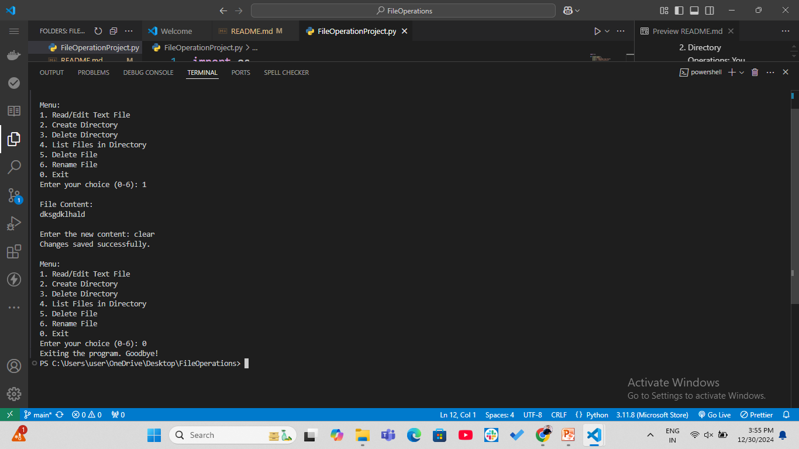

# 📂 File Management System 🗂️

Welcome to the File Management System! 🎉 This is a simple Python program that allows you to perform various file and directory operations, such as reading/editing files, creating/deleting directories, and renaming files. 🖥️✨

## 🚀 Features 🚀

- Read/Edit Text Files ✏️
- Create Directories 📁
- Delete Directories 🗑️
- List Files in Directory 📝
- Delete Files 🗑️
- Rename Files 🔄

## 💡 Installation 💡

- To get started with this project, follow these steps:

1️⃣ Clone the repository:
`git clone https://github.com/SangeetaSharma73/FileOperations.git`

2️⃣ Run the Python script:
Make sure you have Python installed. To run the script, use the following command:
`python FileOperationProject.py`

## 🌟 How to Use 🌟

1. Read/Edit Text File 📖✏️

- Choose option 1 to read or edit a file. You'll be asked to input the file path and new content if editing.

2. Create a Directory 🗂️

- Choose option 2 to create a new directory. Enter the desired path.

3. Delete a Directory 🗑️

- Choose option 3 to delete a directory. Enter the directory path to remove.

4. List Files in a Directory 📝

- Choose option 4 to list all files in a specific directory by providing its path.

5. Delete a File 🗑️

- Choose option 5 to delete a file. Enter the file path to remove it.

6. Rename a File 🔄

- Choose option 6 to rename a file. Provide the current file path and the new name.

## Example Menu

```text
Menu:

1. Read/Edit Text File
2. Create Directory
3. Delete Directory
4. List Files in Directory
5. Delete File
6. Rename File
7. Exit

```

# 🌍 How the Program Works 🌍

1. File Operations: The program allows you to perform basic file operations like reading and editing the content of a text file, deleting files, and renaming files.
2. Directory Operations: You can create directories, delete them, and list all the files within a directory.

## 📥 Dependencies 📥

This project doesn’t require any third-party libraries! Just Python is enough. Ensure that your Python version is up to date.

## 📸 Screenshots 📸

- Here’s a preview of how the program works:
  

## 💬 Contributing 💬

Feel free to contribute by forking the repository 🍴, submitting issues 🐞, and creating pull requests 🔄. Any improvements or features are highly welcome! 🙌

## 📄 License 📄

This project is licensed under the MIT License - see the LICENSE.md file for details. ⚖️
